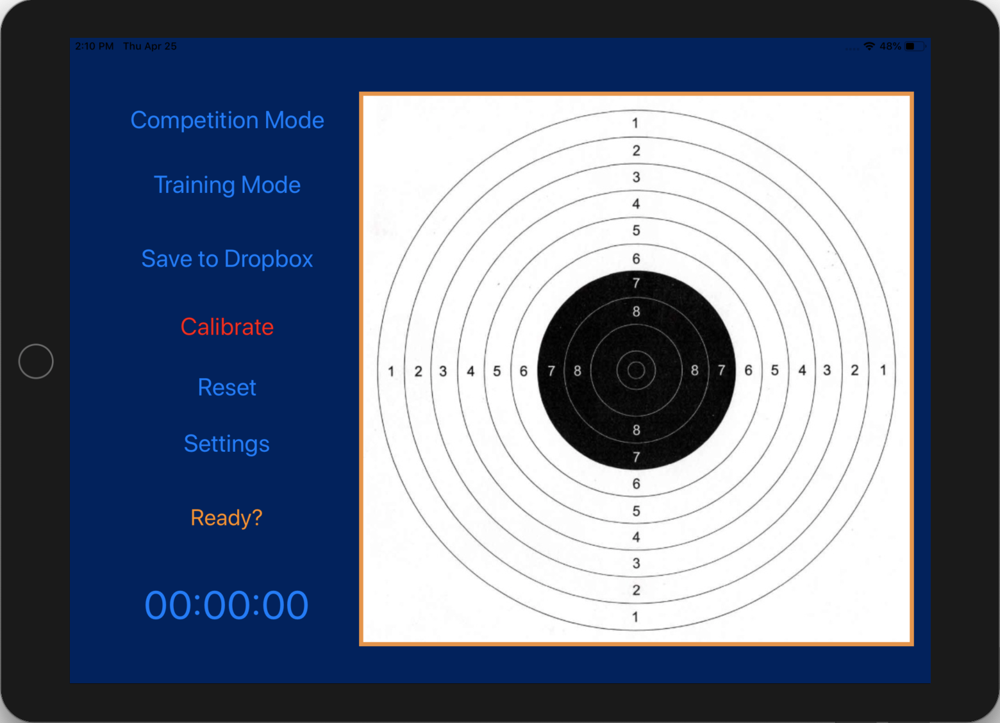

# Modern-Pentathlon-Laser-System

This system allows Modern Pentathletes to train for the combined run-shoot element of Modern Pentathlon. Since 2012, laser pistols have been used in competition, which makes the sport safer especially given that running is involved too. However, it requires more complicated technology in order to identify shots. In this discipline, the athlete has a maximum time of 50 seconds to hit the black of the target 5 times before running 800m. This run-shoot combination is repeated 3 more times meaning 3200m is completed in total. This system uses a camera to visualise the laser pulses on the target and then OpenCV running on a Raspberry Pi to decode the image and identify the exact location of the laser pulse. The controller is an app designed for use on either a smartphone or a tablet. The app has both a training and a competition mode with a stopwatch. Shots are displayed on an image of the target, which can then be saved to Dropbox with a timestamp so that analysis can be performed after training. There are 5 Red/Green LEDs on the target that start red and light up consecutively each time the black of the target is hit. When the 50 seconds are up or all 5 LEDs are green, the lights reset to red. After 40 seconds the LEDs begin to flash and do so more frequently after 45 seconds to signify that time is running out. The connection between the app and the target is enabled by UDP.

